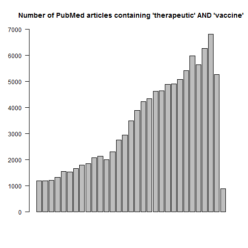

A Test of R Presentation
========================================================
author: Li Lu
date: 24 June, 2016
autosize: true


Slide of Codes for Search of Pubmed by Using RISmed Pacakge: part 1
========================================================


```r
library(RISmed)
 
#now let's look up this dude called Dave Tang
res <- EUtilsSummary('therapeutic AND vaccine', type='esearch', db='pubmed')
 
tally <- array()
x <- 1
for (i in 1986:2016){
  Sys.sleep(1)
  r <- EUtilsSummary('therapeutic AND vaccine', type='esearch', db='pubmed', mindate=i, maxdate=i)
  tally[x] <- QueryCount(r)
  x <- x + 1
}
```


Slide of Codes for Search of Pubmed by Using RISmed Pacakge: part 2
========================================================


```r
barplot(tally, las=2, ylim=c(0,7000), main="Number of PubMed articles containing therapeutic AND vaccine")
```


Slide of a Bar Plot for Number of Yearly Publications on the Topic  
========================================================




